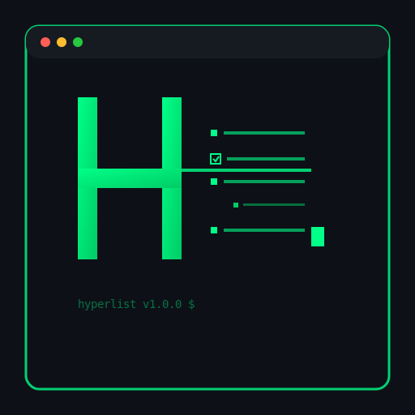
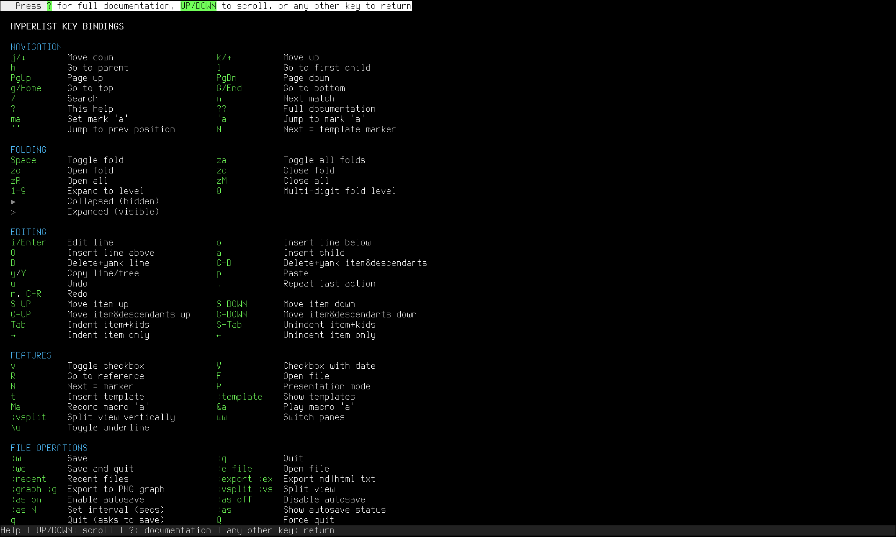

# HyperList TUI



A powerful Terminal User Interface (TUI) application for creating, editing, and managing HyperLists - a methodology for describing anything in a hierarchical, structured format.

<br clear="left"/>

## What is HyperList?

HyperList is a universal methodology for describing anything - any state, item, pattern, action, process, transition, program, instruction set, etc. It can be used as an outliner, a todo list handler, a process design tool, a data modeler, or any other way you want to describe something.

Learn more about the HyperList methodology at: [https://isene.org/hyperlist/](https://isene.org/hyperlist/)

For historical context and the original VIM implementation, see: [hyperlist.vim](https://github.com/isene/hyperlist.vim)

## Screenshots

### Main Interface


### Help Screen


## Features

### Core Functionality
- **Hierarchical Organization**: Create multi-level nested lists with unlimited depth
- **Rich Syntax Highlighting**: Color-coded elements for better readability
  - Properties and dates in red
  - Operators (AND, OR, IF, THEN) in blue
  - Checkboxes in various shades of green
  - References in magenta
  - Hash tags in yellow/orange
  - Comments in cyan
- **Advanced Folding**: Collapse and expand sections with multiple fold levels
- **Powerful Navigation**: Jump between items, references, and markers
- **Full Editing Capabilities**: Create, edit, delete, move, and reorganize items
- **Checkbox Support**: Multiple checkbox types with completion tracking
- **Template System**: Jump to and fill in template markers
- **Presentation Mode**: Focus on current item and ancestors only

### Text Formatting
- **Bold**: `*text*`
- **Italic**: `/text/`
- **Underline**: `_text_`
- **References**: `<reference name>` or `<file:/path/to/file>`
- **Hash tags**: `#tag`
- **Comments**: `; comment text`
- **Dates**: `2025-08-12` or `2025-08-12 14:30`

### Export Formats
- **HTML**: Full-featured HTML with syntax highlighting
- **Markdown**: GitHub-flavored Markdown
- **Plain Text**: Clean text output
- **PNG Graph**: Visual representation using Graphviz

### File Operations
- Multiple file support with recent files list
- Autosave functionality with configurable intervals
- Split view for working with multiple lists

## Installation

### Prerequisites
- Ruby 3.0 or higher
- rcurses gem: `gem install rcurses`
- Optional: Graphviz for PNG export (`apt-get install graphviz` or `brew install graphviz`)

### Install from RubyGems
```bash
gem install hyperlist
```

### Install from Source
```bash
git clone https://github.com/isene/HyperList.git
cd HyperList
chmod +x hyperlist
./hyperlist
```

## Usage

### Basic Usage
```bash
hyperlist                    # Start with empty document
hyperlist file.hl           # Open existing HyperList file
hyperlist file.txt          # Open any text file
```

### Key Bindings

#### Navigation
- `j/↓` - Move down
- `k/↑` - Move up
- `h` - Go to parent item
- `l` - Go to first child
- `g/Home` - Go to top
- `G/End` - Go to bottom
- `/` - Search
- `n` - Next search match
- `N` - Next template marker (=)

#### Editing
- `i/Enter` - Edit line
- `o` - Insert line below
- `O` - Insert line above
- `a` - Insert child item
- `D` - Delete and yank line
- `C-D` - Delete and yank item with descendants
- `y/Y` - Copy line/tree
- `p` - Paste

#### Folding
- `Space` - Toggle fold
- `za` - Toggle all folds
- `1-9` - Expand to level
- `0` - Multi-digit fold level

#### Features
- `v` - Toggle checkbox
- `V` - Toggle checkbox with timestamp
- `R` - Go to reference
- `F` - Open file reference
- `P` - Presentation mode
- `?` - Help screen

#### File Commands
- `:w` - Save
- `:q` - Quit
- `:wq` - Save and quit
- `:e file` - Open file
- `:export html` - Export to HTML
- `:export md` - Export to Markdown
- `:graph` - Export to PNG

## Examples

### Simple Todo List
```
Daily Tasks
    [ ] Morning review
        [ ] Check emails
        [ ] Review calendar
    [ ] Development work
        [ ] Fix bug #123
        [ ] Code review
    [X] Lunch break
    [ ] Afternoon tasks
```

### Project Structure
```
MyProject #project
    Planning Phase
        [X] Define objectives
        [O] Identify stakeholders
        [ ] Create timeline
    Implementation
        Backend Development
            Authentication module
            Database schema
            REST endpoints
        Frontend Development
            Login page
            Dashboard
    Documentation
        Technical docs
        User manual
```

### Meeting Notes with References
```
Team Meeting 2025-08-12 14:00
    Participants
        John (PM)
        Sarah (Dev)
        Mike (Design)
    Discussion Points
        Sprint planning <Sprint-23>
        Bug review <file:./bugs.hl>
        Design updates
            ; Mike will share mockups
    Action Items
        [ ] John: Update roadmap
        [ ] Sarah: Fix critical bugs
        [ ] Mike: Finalize designs
```

## Configuration

The application stores configuration in `~/.hyperlist/`:
- `recent_files.txt` - List of recently opened files
- `marks.yml` - Saved marks across sessions

## Testing

Run the included test suite:
```bash
./hyperlist test.hl
```

Follow the instructions in the test file to verify all features are working correctly.

## Contributing

Contributions are welcome! Please feel free to submit issues and pull requests.

## License

This software is released into the **Public Domain**.

## Author

Created by Geir Isene - [https://isene.org](https://isene.org)

Based on the HyperList methodology and inspired by the original hyperlist.vim plugin.

## Acknowledgments

- The rcurses library for excellent terminal UI capabilities
- The Ruby community for a wonderful programming language
- All contributors and users of HyperList

---

For more information about HyperList, visit [https://isene.org/hyperlist/](https://isene.org/hyperlist/)