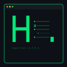
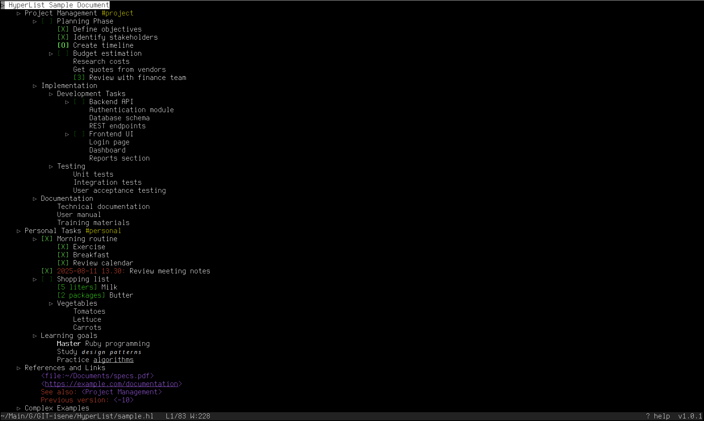
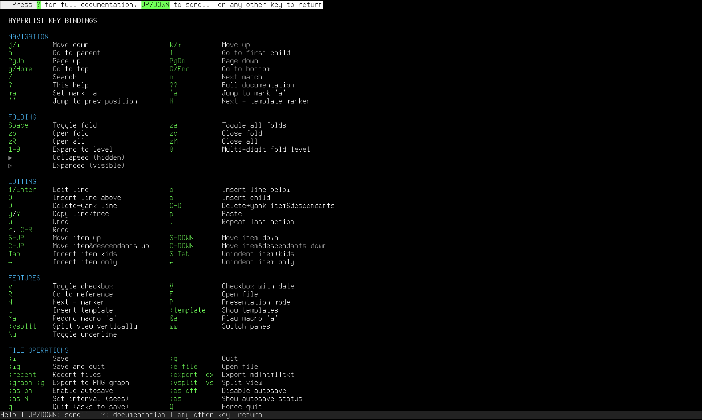

# HyperList TUI

[](https://badge.fury.io/rb/hyperlist)
[](https://unlicense.org/)
[](https://www.ruby-lang.org/)
[](https://github.com/isene/HyperList/stargazers)
[](https://isene.org)


<br clear="left"/>

A powerful Terminal User Interface (TUI) application for creating, editing, and managing HyperLists - a methodology for describing anything in a hierarchical, structured format.

<br clear="left"/>

## What is HyperList?

HyperList is a universal methodology for describing anything - any state, item, pattern, action, process, transition, program, instruction set, etc. It can be used as an outliner, a todo list handler, a process design tool, a data modeler, or any other way you want to describe something.

Learn more about the HyperList methodology at: [https://isene.org/hyperlist/](https://isene.org/hyperlist/)

For historical context and the original VIM implementation, see: [hyperlist.vim](https://github.com/isene/hyperlist.vim)

## Screenshots

### Main Interface


### Help Screen


## What's New in v1.2.4

### 🎯 Enhanced Item Movement & Editing
- **Smart Item Movement**: `C-UP`/`C-DOWN` now move items past siblings at the same level
- **Cursor Tracking**: Cursor follows moved items to their new position
- **Auto-renumbering**: Numbered lists automatically renumber when items are moved or deleted
- **Outdented Insert**: Press `A` to insert a new item one level less indented
- **Quick Save & Quit**: Press `W` as a shortcut for `:wq`
- **Configurable Indentation**: Press `I` to cycle between 2-5 spaces per indent level
- **Auto-detect Indentation**: Automatically detects indentation from loaded files
- **Global Settings**: Indentation preference saved in `~/.hyperlist/config.yml`

## Previous Updates

### v1.2.0 - User-Defined Templates
- **Save as Template**: Save any HyperList document as a reusable template (`:st`)
- **Template Manager**: List and delete your custom templates (`:lt`, `:dt`)
- **Enhanced Template Browser**: Shows both built-in and user templates
- **Template Metadata**: Includes description and creation date
- Templates stored in `~/.hyperlist/templates/` for easy backup and sharing

### v1.1.0 - Encryption Support
- **File-level encryption** for sensitive files (dot files like `.passwords.hl`)
- **Line-level encryption** for individual items (Ctrl-E to toggle)
- Secure AES-256-CBC encryption with PBKDF2 key derivation
- Password caching for the session

### 🎯 Enhanced Presentation Mode
- **Auto-collapse** everything outside the current context
- **Smart focus**: Shows only current item, ancestors, and immediate children
- **Visual hierarchy**: Focused items in full color, others greyed out
- Improved navigation with proper cursor tracking

### 🎨 Better Visual Experience
- **Improved highlighting**: Dark gray background preserves syntax colors
- **Subtle selection**: No more harsh reverse video
- **Preserved colors**: All HyperList elements maintain their colors when selected

## Features

### Core Functionality
- **Hierarchical Organization**: Create multi-level nested lists with unlimited depth
- **Rich Syntax Highlighting**: Color-coded elements for better readability
  - Properties and dates in red
  - Operators (AND, OR, IF, THEN) in blue
  - Checkboxes in various shades of green
  - References in magenta
  - Hash tags in yellow/orange
  - Comments in cyan
- **Advanced Folding**: Collapse and expand sections with multiple fold levels
- **Powerful Navigation**: Jump between items, references, and markers
- **Full Editing Capabilities**: Create, edit, delete, move, and reorganize items
- **Checkbox Support**: Multiple checkbox types with completion tracking
- **Template System**: Built-in templates plus save/load custom templates
- **Presentation Mode**: Focus on current item with auto-collapse

### Security Features
- **Encryption**: Protect sensitive data with AES-256 encryption
- **Automatic detection**: Dot files automatically prompt for encryption
- **Line-level security**: Encrypt individual sensitive items
- **Visual indicators**: Encrypted lines show lock icon

### Text Formatting
- **Bold**: `*text*`
- **Italic**: `/text/`
- **Underline**: `_text_`
- **References**: `<reference name>` or `<file:/path/to/file>`
- **Hash tags**: `#tag`
- **Comments**: `; comment text`
- **Dates**: `2025-08-12` or `2025-08-12 14:30`

### Export Formats
- **HTML**: Full-featured HTML with syntax highlighting
- **Markdown**: GitHub-flavored Markdown
- **Plain Text**: Clean text output
- **PNG Graph**: Visual representation using Graphviz

### File Operations
- Multiple file support with recent files list
- Autosave functionality with configurable intervals
- Split view for working with multiple lists
- Encryption support for sensitive files

## Installation

### Prerequisites
- Ruby 3.0 or higher
- rcurses gem: `gem install rcurses`
- Optional: Graphviz for PNG export (`apt-get install graphviz` or `brew install graphviz`)

### Install from RubyGems
```bash
gem install hyperlist
```

### Install from Source
```bash
git clone https://github.com/isene/HyperList.git
cd HyperList
chmod +x hyperlist
./hyperlist
```

## Usage

### Basic Usage
```bash
hyperlist                    # Start with empty document
hyperlist file.hl           # Open existing HyperList file
hyperlist .passwords.hl     # Open encrypted file (will prompt for password)
hyperlist file.txt          # Open any text file
```

### Key Bindings

#### Navigation
- `j/↓` - Move down
- `k/↑` - Move up
- `h` - Go to parent item
- `l` - Go to first child
- `g/Home` - Go to top
- `G/End` - Go to bottom
- `/` - Search
- `n` - Next search match
- `N` - Next template marker (=)

#### Editing
- `i/Enter` - Edit line
- `o` - Insert line below
- `O` - Insert line above
- `a` - Insert child item
- `A` - Insert outdented item (one level less)
- `I` - Cycle indentation size (2-5 spaces)
- `D` - Delete and yank line
- `C-D` - Delete and yank item with descendants
- `y/Y` - Copy line/tree
- `p` - Paste

#### Folding
- `Space` - Toggle fold
- `za` - Toggle all folds
- `1-9` - Expand to level
- `0` - Multi-digit fold level

#### Features
- `v` - Toggle checkbox
- `V` - Toggle checkbox with timestamp
- `C-E` - Encrypt/decrypt current line
- `R` - Go to reference
- `F` - Open file reference
- `P` - Presentation mode (with auto-collapse)
- `t` - Insert template (built-in or custom)
- `?` - Help screen

#### File Commands
- `:w` - Save
- `:q` - Quit
- `:wq` or `W` - Save and quit
- `:e file` - Open file
- `:export html` - Export to HTML
- `:export md` - Export to Markdown
- `:graph` - Export to PNG

#### Template Commands
- `:st` - Save current document as template
- `:dt` - Delete a user template
- `:lt` - List all user templates
- `t` - Browse and insert templates

## Examples

### Simple Todo List
```
Daily Tasks
    [ ] Morning review
        [ ] Check emails
        [ ] Review calendar
    [ ] Development work
        [ ] Fix bug #123
        [ ] Code review
    [X] Lunch break
    [ ] Afternoon tasks
```

### Encrypted Password Manager
Save as `.passwords.hl` for automatic encryption:
```
Online Accounts
    GitHub
        Username: myuser
        Password: [will be encrypted]
        2FA: enabled
    Banking
        Account: 12345678
        PIN: [will be encrypted]
```

### Project Structure
```
MyProject #project
    Planning Phase
        [X] Define objectives
        [O] Identify stakeholders
        [ ] Create timeline
    Implementation
        Backend Development
            Authentication module
            Database schema
            REST endpoints
        Frontend Development
            Login page
            Dashboard
    Documentation
        Technical docs
        User manual
```

### Meeting Notes with References
```
Team Meeting 2025-08-12 14:00
    Participants
        John (PM)
        Sarah (Dev)
        Mike (Design)
    Discussion Points
        Sprint planning <Sprint-23>
        Bug review <file:./bugs.hl>
        Design updates
            ; Mike will share mockups
    Action Items
        [ ] John: Update roadmap
        [ ] Sarah: Fix critical bugs
        [ ] Mike: Finalize designs
```

## Configuration

The application stores configuration in `~/.hyperlist/`:
- `recent_files.txt` - List of recently opened files
- `marks.yml` - Saved marks across sessions

## Testing

Run the included test suite:
```bash
./hyperlist test.hl
```

Follow the instructions in the test file to verify all features are working correctly.

## Contributing

Contributions are welcome! Please feel free to submit issues and pull requests.

## Changelog

### v1.1.1 (2025-08-13)
- **Fixed**: Critical navigation bug where the last item (line 154 in test.hl) was not reachable when pressing 'G'
- **Fixed**: Improved scrolling behavior to properly handle wrapped lines using rcurses built-in capabilities
- **Fixed**: Split view navigation - g/G/Home/End/PgUp/PgDown now correctly affect the active pane
- **Added**: Wrap-around navigation in split view right pane (UP from first goes to last, DOWN from last goes to first)
- **Added**: Visual end-of-document indicator (blank line at bottom) for better UX
- **Improved**: Scroll calculations now dynamically account for line wrapping

### v1.1.0 (2025-08-12)
- Added encryption support for sensitive documents
- Enhanced presentation mode
- Various bug fixes and improvements

## License

This software is released into the **Public Domain**.

## Author

Created by Geir Isene - [https://isene.org](https://isene.org)

Based on the HyperList methodology and inspired by the original hyperlist.vim plugin.

## Acknowledgments

- The rcurses library for excellent terminal UI capabilities
- The Ruby community for a wonderful programming language
- All contributors and users of HyperList

---

For more information about HyperList, visit [https://isene.org/hyperlist/](https://isene.org/hyperlist/)